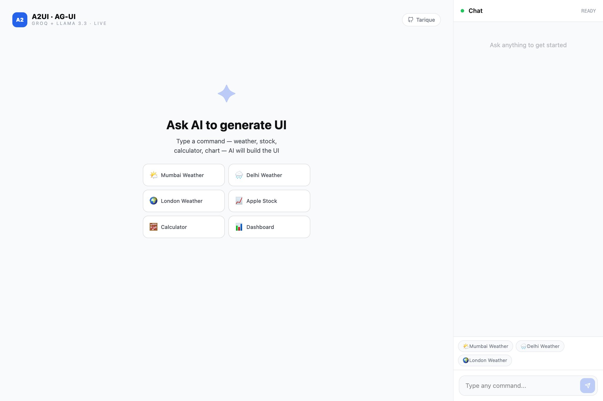

# UIGen — AI-Powered Generative UI

> Build interfaces by talking. UIGen listens to your command and instantly renders a live, interactive UI — weather, stocks, charts, calculators and more.




[](https://uigenerative.vercel.app)
[](https://nextjs.org)
[](https://react.dev)
[](https://www.typescriptlang.org)
[](https://groq.com)
[](https://openweathermap.org)

---

## What is UIGen?

UIGen demonstrates the **A2UI** and **AG-UI** concepts — an AI agent that reads your natural language input and returns a JSON description of the UI to render. The frontend maps that JSON to native React components in real time.

**No hardcoded screens. The AI decides what to show.**

---

## 🤖 What the AI Can Generate

### 🌤️ Weather Card — **Live Data**
Powered by **OpenWeatherMap API** — fetches real-time data for any city in the world.

> _"What's the weather in Mumbai?"_  
> _"Weather in Tokyo right now"_  
> _"Current weather in London"_

Shows: temperature, feels like, conditions, humidity, wind speed, pressure, visibility, high/low

---

### 📈 Stock Card — Mock Data
Displays a stock price ticker with up/down indicator.

> _"Show me Apple stock price"_  
> _"TSLA stock"_  
> _"Google share price"_

Shows: symbol, price, % change, daily high/low, volume

> ⚠️ Stock data is illustrative — not connected to a live stock API yet.

---

### 🧮 Calculator — Fully Functional
A working calculator — not just a UI, it actually computes.

> _"Open calculator"_  
> _"I need a calculator"_

Supports: +, −, ×, ÷, decimals, chained operations

---

### 📊 Dashboard / Bar Chart
Renders a bar chart with summary stats.

> _"Show sales dashboard"_  
> _"Show me a monthly revenue chart"_  
> _"Display Q1 performance"_

Shows: bar chart, total, peak value, average — AI generates the data labels and values.

---

### ⊞ Data Table
Renders a structured table with custom columns and rows.

> _"Show a data table"_  
> _"List top products in a table"_

AI generates column headers and row data based on context.

---

### 💳 Product Card
A product/pricing card with CTA button.

> _"Show a product card"_  
> _"Display pricing for Premium plan"_

Shows: title, description, price, badge, Buy Now button

---

### 💬 Chat (Fallback)
For anything that doesn't match the above — AI replies in plain text.

> _"What is AG-UI?"_  
> _"Explain A2UI"_  
> _"Hello"_

---

## 🧠 How It Works

```
User types a command
        ↓
POST /api/ai  (Next.js API Route)
        ↓
Groq LLaMA 3.3 70B reads the message
returns structured JSON:
{ "component": "weather", "data": { "location": "Mumbai" } }
        ↓
If component = "weather":
  → fetchWeather() calls OpenWeatherMap API
  → returns live weather data
        ↓
ComponentRenderer maps JSON → React component
        ↓
UI renders instantly
```

**The AI never returns HTML.** It returns a JSON description. The frontend renders it natively — this is the A2UI pattern.

---

## 🛠 Tech Stack

| Layer | Technology |
|---|---|
| Framework | Next.js 16.2.7 (App Router + Turbopack) |
| Language | TypeScript 5 |
| UI Library | React 19 — no component library, pure inline styles |
| AI Model | Groq API — LLaMA 3.3 70B Versatile |
| Live Weather | OpenWeatherMap API |
| CSS | Tailwind CSS 4 |
| Deployment | Vercel |

---

## 📁 Project Structure

```
uigen/
├── app/
│   ├── page.tsx                  # Main layout
│   └── api/
│       └── ai/
│           └── route.ts          # Groq + OpenWeather API logic
├── components/
│   ├── WeatherCard.tsx           # Live weather UI
│   ├── StockCard.tsx             # Stock ticker UI
│   ├── CalculatorWidget.tsx      # Functional calculator
│   ├── DashboardWidget.tsx       # Bar chart + stats
│   ├── TableWidget.tsx           # Data table
│   ├── CardWidget.tsx            # Product card
│   ├── ChatPanel.tsx             # Chat sidebar / mobile drawer
│   ├── ComponentRenderer.tsx     # JSON → component mapper
│   └── EmptyState.tsx            # Landing screen with suggestions
├── hooks/
│   ├── useChat.ts                # API calls + message state
│   └── useIsMobile.ts            # Responsive breakpoint hook
├── types/
│   └── index.ts                  # TypeScript interfaces
└── constants/
    └── suggestions.ts            # Quick-action chips
```

---

## 🚀 Getting Started

### Prerequisites
- Node.js 18+
- [Groq API key](https://console.groq.com) — free
- [OpenWeatherMap API key](https://openweathermap.org/api) — free

### Installation

```bash
# Clone the repo
git clone https://github.com/tariquea266/uigen.git
cd uigen

# Install dependencies
npm install

# Setup environment variables
cp .env.example .env.local
```

### Environment Variables

```env
GROQ_API_KEY=your_groq_api_key_here
OPENWEATHER_API_KEY=your_openweather_api_key_here
```

| Variable | Where to get |
|---|---|
| `GROQ_API_KEY` | [console.groq.com](https://console.groq.com) — free |
| `OPENWEATHER_API_KEY` | [openweathermap.org/api](https://openweathermap.org/api) — free tier |

```bash
# Run locally
npm run dev
```

Open [http://localhost:3000](http://localhost:3000)

---

## 📱 Responsive Design

| Screen | Layout |
|---|---|
| Desktop `> 768px` | Split view — generated UI on left, chat sidebar on right |
| Mobile `< 768px` | Full screen UI + floating chat button (FAB) bottom-right |

On mobile — tap the **blue chat icon** to open the chat drawer from below.

---

## 🔮 Concepts Demonstrated

### A2UI — Agent to UI
The AI agent returns a **JSON description** of the component it wants to display. The frontend maps this JSON to native React components. The agent never sends HTML — it sends intent, the frontend renders it.

```json
{ "component": "weather", "data": { "location": "Mumbai, IN" } }
```

### AG-UI — Agentic UI Protocol
A standardized protocol for real-time communication between AI agents and frontend apps. UIGen demonstrates the core idea: structured agent output driving dynamic UI rendering.

---

## 📦 Scripts

```bash
npm run dev      # Development server (Turbopack)
npm run build    # Production build
npm run start    # Start production server
npm run lint     # ESLint
```

---

## 🌐 Deploy Your Own

[](https://vercel.com/new/clone?repository-url=https://github.com/tariquea266/uigen)

After deploying, add `GROQ_API_KEY` and `OPENWEATHER_API_KEY` in Vercel → Project → Settings → Environment Variables.

---

## 👤 Author

**Tarique**  
GitHub: [@tariquea266](https://github.com/tariquea266)  
Live: [uigenerative.vercel.app](https://uigenerative.vercel.app)

---

## 📄 License

MIT
